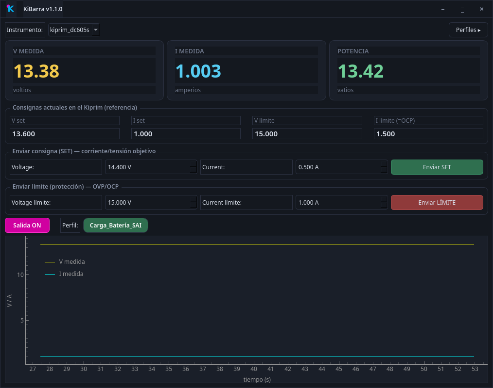
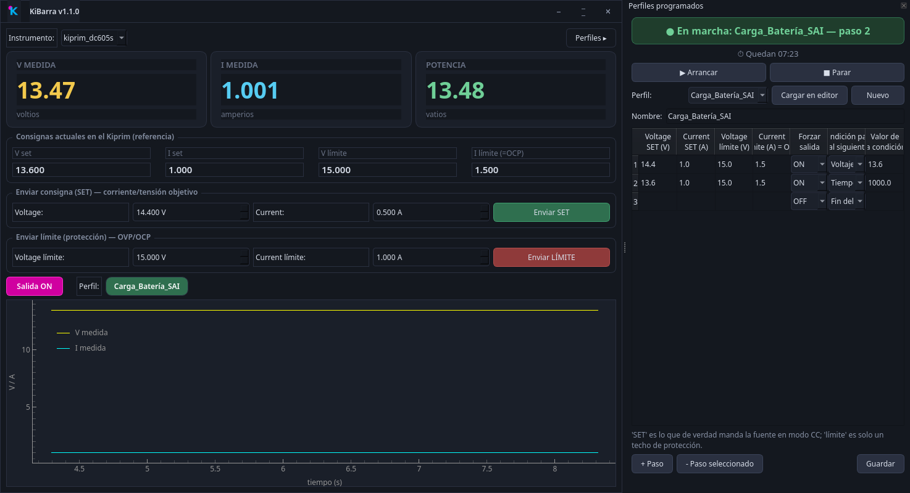

# KiBarra

Control y monitorización de fuentes de laboratorio **Kiprim/OWON** (DC605S, DC310S y compatibles) por puerto serie, con perfiles de carga programables y un bridge MQTT independiente de la interfaz gráfica.

## Control manual



Lecturas en vivo (V/I/P), envío de consigna real (SET) y de los techos de protección (OVP/OCP) por separado, y gráfica en tiempo real. Todo lo que se ve aquí ya es más de lo que da el panel físico del instrumento: consignas y límites separados con claridad, e historial visual.

## Lo realmente interesante: perfiles programados



Esto es lo que un Kiprim/OWON **no puede hacer por sí solo**: encadenar etapas con condiciones. El panel lateral permite definir un perfil como una secuencia de pasos — cada uno con su propia consigna de V/I y una condición para pasar al siguiente (tiempo transcurrido, o que la corriente/voltaje medidos crucen un umbral) — y ejecutarlo con cuenta atrás y progreso en vivo. Convierte una fuente CC/CV manual en un cargador/programador de verdad: bulk → flotación → corte automático, sin tocar nada durante horas.

## Qué hace

- **Driver serie** para la familia Kiprim/OWON (protocolo tipo SCPI, 115200 8N1), validado contra hardware real.
- **Descubrimiento automático**: identifica cada instrumento por su `*idn?` (modelo + número de serie), sin depender de qué `/dev/ttyUSB*` le toque en cada arranque.
- **Bridge en segundo plano** (systemd): único dueño del puerto serie, habla por MQTT, sigue funcionando aunque cierres la GUI o apagues el PC que la lanzó.
- **Control seguro**: cualquier cambio de consigna con la salida ya encendida se aplica en un ciclo OFF → fijar → ON. En esta familia de instrumentos, el límite de corriente y el OCP comparten registro interno — cambiarlo en caliente sin este ciclo puede disparar la protección por sorpresa.
- **Perfiles de carga programables**: una máquina de estados por pasos (YAML), editable desde la propia GUI.
- **GUI nativa (PySide6)**: cliente MQTT desacoplado del bridge — se puede cerrar sin interrumpir nada en marcha.
- **Log local en CSV** por sesión, independiente de MQTT, como respaldo.

## Arquitectura

```
Kiprim/OWON (USB) ── bridge (systemd, Python) ── MQTT ── GUI (PySide6)
                                                       └── Telegraf → InfluxDB → Grafana (opcional)
```

El bridge es el único proceso que toca el puerto serie. Todo lo demás —GUI, dashboards, futuros clientes web o ESP32— son clientes MQTT que se pueden conectar y desconectar sin afectar a una carga en marcha.

## Instalación completa

Tres piezas, las tres en la misma máquina si no tienes servidor propio: un broker MQTT, el bridge, y la GUI.

**1. Broker MQTT** (si no tienes uno ya):

```bash
sudo apt install mosquitto
```

Con la instalación por defecto ya escucha en `localhost:1883`, que es lo que espera la configuración de serie.

**2. Bridge** (el que habla con el instrumento por USB):

```bash
python3 -m venv .venv
.venv/bin/pip install pyserial paho-mqtt pyyaml
cp config.yaml.example config.yaml
```

Conecta tu Kiprim/OWON por USB y arranca el bridge una vez a mano para ver su número de serie en el log:

```bash
.venv/bin/python -m bridge.service
```

Copia ese número de serie a `config.yaml` (no `config.yaml.example`, ese es solo la plantilla), bajo `instrumentos:`, con el alias que quieras. Para que quede corriendo siempre de fondo, copia `systemd/kiprim-bridge.service` a `~/.config/systemd/user/`, **ajusta las rutas** (`/ruta/a/fuente-alimentacion` por dónde hayas clonado el repo) y actívalo:

```bash
systemctl --user daemon-reload
systemctl --user enable --now kiprim-bridge.service
```

**3. GUI:**

Instala el `.deb` de la [última Release](../../releases), o desde código fuente:

```bash
.venv/bin/pip install PySide6 pyqtgraph
.venv/bin/python gui/main.py
```

## Perfiles de carga

Cada perfil es un YAML en `profiles/` con una lista de pasos. Cada paso puede fijar `voltage` / `current` (consigna real) y `voltage_limit` / `current_limit` (techo de protección), y termina cuando se cumple su condición `hasta`:

```yaml
nombre: carga_agm
pasos:
  - voltage: 14.4
    current: 1.0
    current_limit: 1.5
    hasta:
      corriente_medida_bajo: 0.15   # o voltage_medido_alto, tiempo, etc.
  - voltage: 13.6
    hasta:
      tiempo: 1800
  - output: 'OFF'
```

Se pueden crear y editar desde el panel "Perfiles" de la GUI, sin tocar YAML a mano.

## Próximo paso: control remoto sin PC encendido

El bridge tal cual está necesita un PC (o similar) siempre encendido con el USB del instrumento a mano. El siguiente proyecto es sustituir eso por un **ESP32-S3**, aprovechando su USB nativo con soporte de modo Host (driver CDC-ACM de ESP-IDF) para hablar directamente con el chip serie del instrumento, sin PC de por medio — solo el ESP32-S3 alimentado y conectado al Kiprim, accesible por WiFi.

La idea es reescribir la lógica ya validada aquí (protocolo, ciclo seguro de cambio de consigna, motor de perfiles) en C/ESP-IDF, empezando por una prueba mínima: confirmar que el USB Host del S3 enumera el instrumento y consigue intercambiar un `*idn?` antes de ir a por el resto.
